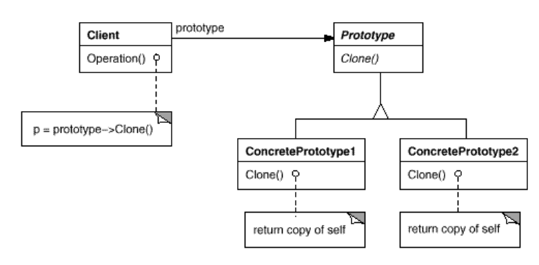

# Design Patterns Summary
Most summary words from
* GoF
* https://refactoring.guru/design-patterns

---
## Abstract Factory
* Abstract Factory is a creational design pattern that lets you produce **families** of related objects without specifying their concrete classes.
* Provide an interface for creating families of related or dependent objects without specifying their concrete classes.
* Think about UI components families

## Adapter
* Adapter is a structural design pattern that allows objects with **incompatible interfaces** to collaborate.
* Two kind of adapters:
  * Object adapter, with object composition
  * Class adapter, with inheritance

## Composite
* Composite is a structural design pattern that lets you compose objects into **tree structures** and then work with these structures as if they were individual objects.
* Compose objects into **tree structures** to represent **part-whole** hierarchies. Composite lets clients treat individual objects and compositions of objects uniformly .

## Strategy
* Strategy is a behavioral design pattern that lets you define a **family of algorithms**, put each of them into a separate class, and make their objects **interchangeable**.
* Define a **family of algorithms**, encapsulate each one, and make them interchangeable. Strategy lets the algorithm vary independently from clients that use it.

## State
* State is a behavioral design pattern that lets an object alter its behavior when its internal state changes. It appears as if the object changed its class.
* Allow an object to **alter its behavior** when its **internal state changes**. The object will appear to change its class.
* The State pattern is closely related to the concept of a Finite-State Machine
* The State pattern suggests that you create **new classes for all possible states** of an object and extract all **state-specific behaviors into these classes**.

## Observer
* Also known as: Event-Subscriber, Listener, Dependents, **Publish-Subscribe**
* Observer is a behavioral design pattern that lets you define a **subscription** mechanism to **notify multiple objects about any events** that happen to the object they’re observing.
* Define a one-to-many dependency between objects so that when one object changes state, all its dependents are notified and updated automatically.
* The object that has some interesting state is often called **subject**, but since it’s also going to notify other objects about the changes to its state, we’ll call it **publisher**. All other objects that want to track changes to the publisher’s state are called **subscribers**.

## Singleton
* Singleton is a creational design pattern that lets you ensure that **a class has only one instance**, while providing a **global access point** to this instance.

## Decorator
* Attach additional responsibilities to an object dynamically. Decorators provide a flexible alternative to subclassing for extending functionality.
* Decorator is a structural design pattern that lets you attach new behaviors to objects by placing these objects inside special wrapper objects that contain the behaviors.
* Wrapper
* Sometimes we want to add responsibilities to **individual objects**, not to an entire class.
* to add responsibilities to individual objects **dynamically** and transparently,
* Read more on GoF, UI example
* Read more on HeadFirst Design Pattern, how to calculate coffee price example

## Template Method
* Template Method is a behavioral design pattern that defines the **skeleton of an algorithm in the superclass** but lets **subclasses override** specific steps of the algorithm **without changing its structure**.
* Define the skeleton of an algorithm in an operation, deferring some steps to subclasses. Template Method **lets subclasses redefine certain steps** of an algorithm without changing the algorithm's structure.
* Template methods lead to an inverted control structure that's sometimes referred to as "the Hollywood principle," that is, **"Don't call us, we'll call you"**. This refers to how a **parent class calls the operations of a subclass** and not the other way around.

#### Structure

from https://refactoring.guru/design-patterns/template-method
#### Example

from https://refactoring.guru/design-patterns/template-method

## Factory Method
* Define an interface for creating an object, but **let subclasses decide which class to instantiate**. Factory Method lets a class defer instantiation to subclasses.
* aka. Virtual Constructor
* Factory methods are usually called within Template Methods. In the document example above, NewDocument is a template method.
#### Structure

from GoF
#### Example

from GoF

## Prototype
* Prototype is a creational design pattern that lets you copy existing objects without making your code dependent on their classes.
* Specify the kinds of objects to create using a prototypical instance, and create new objects by copying this prototype.
* Since you have to know the object’s class to create a duplicate, your code becomes dependent on that class. Sometimes you **only know the interface** that the object follows, but not its concrete class, when, for example, a parameter in a method accepts any objects that follow some interface.
* The Prototype pattern **delegates the cloning** process to the actual objects that are being cloned. The pattern declares **a common interface for all objects that support cloning**. This interface lets you clone an object without coupling your code to the class of that object. Usually, such an interface contains just a single **clone method**.
* Let objects clone themself
#### Structure

## Builder
* Builder is a creational design pattern that lets you construct **complex objects step by step**. The pattern allows you to produce different types and representations of an object using the **same construction code**.
* Separate the construction of a complex object from its representation so that the same construction process can create different representations.

#### Structure

from GoF

from https://refactoring.guru/design-patterns/builder

#### Example

from GoF

---

# 我的理解
* 我理解的Design Pattern就是和OO Design一起, 识别容易变化的地方, 并封装起来, 同时对扩展开放对修改封闭
* 像是构建一个尽可能抽象的主体framework, 在framework的一些hook点上做扩展, 但是对framework本身的修改应该尽可能避免

# 学习笔记
* https://refactoring.guru/design-patterns/ 适合经常翻看, 快速复习, 同时还包含**各个语言的代码实现非常好**
* 对GoF, 
  * Introduction 反复多读几遍, 写code 做design前回来看一遍, 收获很大
    * 要区分class inheritance/interface inheritance
      * class inheritance means implementation inheritance
      * interface inheritance(subtyping) means an object can be used in place of another
  * 每一个模式不需要看code, 看看对模式的介绍和总结, 再看看第一章, 就可以了. 关键是要勤翻阅, 每次写代码遇到OO Design时都复习一下
* HeadFirst design 确实不错可以多看几遍
* Composition is about the relationships between objects. Delegation is about passing work from one object to another.
* 学习Design Pattern的重点不是代码如何实现模式, 相比代码理解UML图更加重要, 把图记在脑中. 不同的语言实现方式不同, 记住了图+搜索引擎(ChatGPT)就能轻松映射到各个语言实现上

#### Composition, Delegation, Aggregation
* from [link](https://stackoverflow.com/questions/2137201/composition-vs-delegation)
  * The term "composition" is usually used in terms of object modelling as an expression of a "has-a" relationship and is a form of association (another being aggregation). This is usually contrasted with "inheritance" ("is-a" relationship).
  * What's the difference between composition and aggregation? Composition implies that the child cannot exist without the context of the parent.
 

# Links
* A great design patterns learning website, you should love it: [The Catalog of Design Patterns](https://refactoring.guru/design-patterns/catalog)