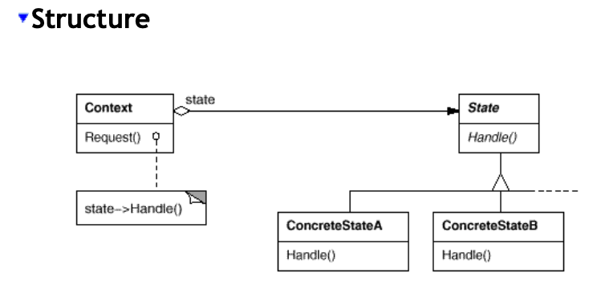
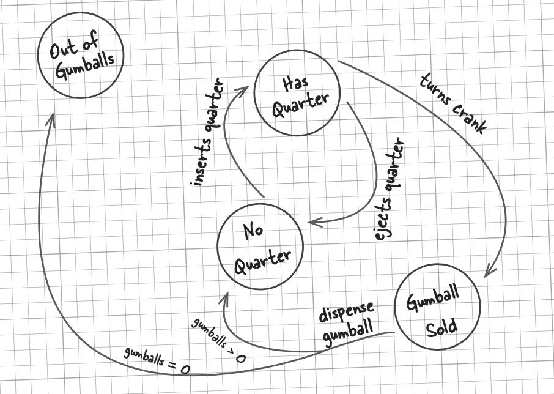
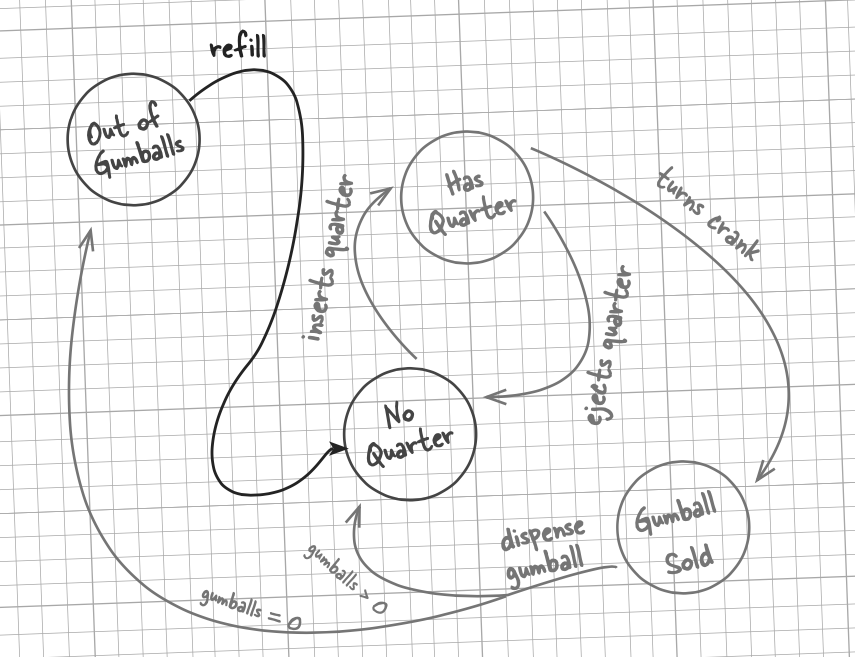
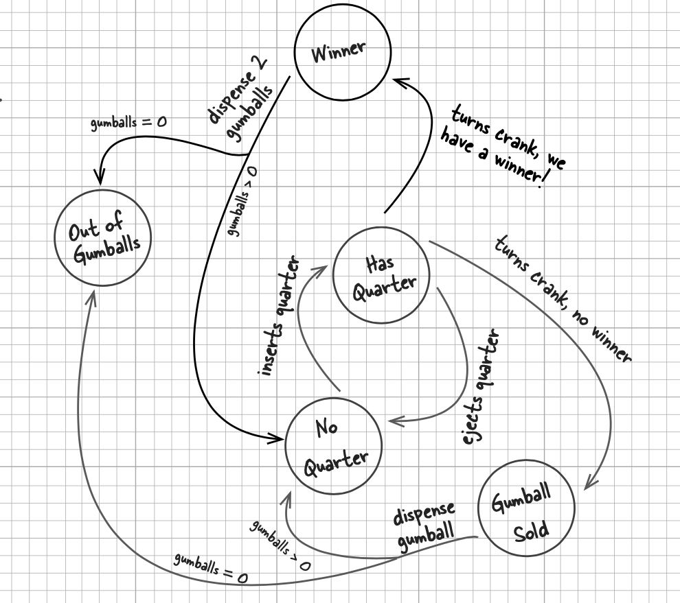

## State

* 允许对象在内部状态改变时改变它的行为, 对象看起来好像修改了它的类
* Context的行为随时可以委托到State对象中的一个
* Also see https://refactoring.guru/design-patterns/state

## Basic GumballMachine States

## With Refill Transition

## With Winner State

